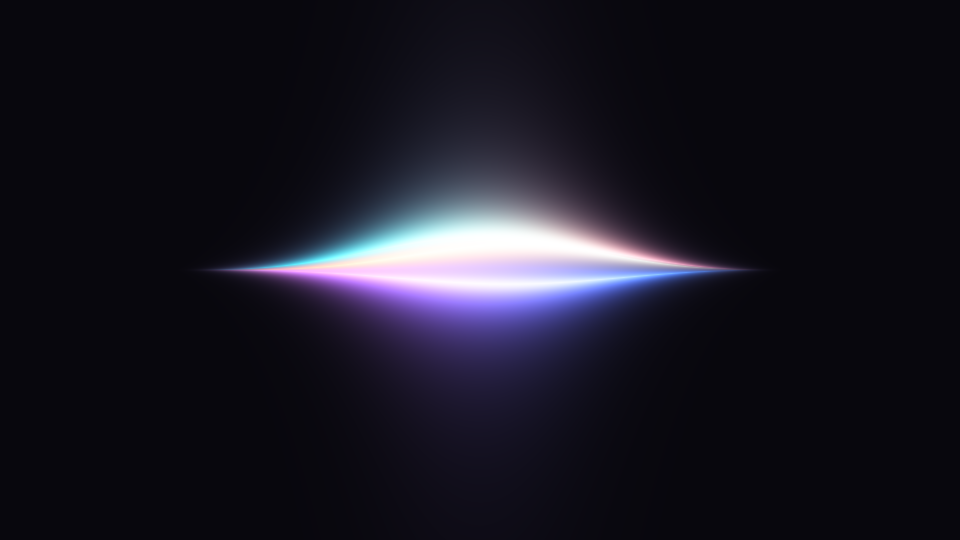

<div align="center">

# Aura Voxtype HUD

**React Bits Strands, locally adapted into a voice-reactive Voxtype HUD for Omarchy Quattro.**

Transparent, cardless, theme-aware, and rendered directly inside the existing Omarchy shell.



*The full React Bits flow, rendered natively in the Omarchy shell.*

[](LICENSE)
[](https://omarchy.org)
[]()

[Features](#features) · [Install](#install) · [Voice response](#voice-response) ·
[Configure](#configure) · [Update](#update) · [Remove](#remove) ·
[How it works](#how-it-works)

</div>

---

## Features

- **The real flow** — uses the exact upstream Strands shader mathematics, acquired from React Bits and compiled locally during setup.
- **Speech-aware, not syllable-driven** — a gated envelope moves smoothly from a subdued listening state into the original flow without making the strands flap like a waveform.
- **Graceful lifecycle** — recording fades in, natural pauses are bridged for two seconds, longer silence settles toward idle, and transcription completion fades away over 800 ms.
- Omarchy theme colors update live; the React Bits orange, purple, and cyan demo palette is one setting away.
- Recording, streaming, and transcription states are automatic. The HUD disappears at idle and stops rendering frames.
- The 640×480 transparent canvas follows the focused monitor, sits in its lower quarter, and never captures input.
- Optional glass-ball rendering adds edge refraction and dispersion.
- No second Quickshell process, `sudo`, or changes below `/usr/share`.
- The public plugin contains no React Bits source or generated port.

## Requirements

- Omarchy Quattro with shell plugin support
- Voxtype 1.0.1 or newer, including `/usr/bin/voxtype-audio-bridge`
- Qt 6 / Quickshell supplied by Omarchy
- `curl`, `sha256sum`, and network access to `raw.githubusercontent.com` during setup

## Install

Add the plugin and run the reviewed setup script:

```sh
omarchy plugin add https://github.com/Sh3nron/omarchy-aura-voxtype-hud.git --yes
~/.config/omarchy/plugins/io.github.sh3nron.aura-voxtype-hud/setup.sh --yes
```

Setup downloads a pinned React Bits Strands registry artifact and its license directly from the upstream repository, verifies both SHA-256 hashes, converts the shaders for Qt, and compiles them under `~/.local/state/aura-voxtype-hud/`. It then creates timestamped backups, disables only Voxtype's stock OSD, enables this plugin, and restarts Voxtype and the Omarchy shell.

To install with the original React Bits demo palette instead of the community theme-aware default:

```sh
~/.config/omarchy/plugins/io.github.sh3nron.aura-voxtype-hud/setup.sh --palette original
```

Preview setup without changing anything:

```sh
~/.config/omarchy/plugins/io.github.sh3nron.aura-voxtype-hud/setup.sh --dry-run --yes
```

## Voice response

Press and hold F9 as usual. Before speech, Aura keeps the strands restrained but visibly alive. The first detected words ease the effect into the original React Bits motion. A two-second speech gate carries the full flow naturally across pauses between phrases; sustained silence then settles it back toward the listening state. Releasing F9 starts transcription and ends with a soft 800 ms fade instead of removing the surface abruptly.

Raw microphone amplitude never bends the geometry directly. Voice activity controls a smoothed flow envelope, which prevents individual syllables from opening and closing the strands like lips.

## Configure

Edit `~/.config/voxtype/aura-strands-hud.json`. Changes reload live.

`paletteMode` accepts:

- `omarchy` — maps the active theme's `orange`, `magenta`, and `cyan` tokens. This is the default.
- `original` — uses `#F97316`, `#7C3AED`, and `#06B6D4`.
- `custom` — uses the `colors` array, with one to eight `#RRGGBB` values.

The familiar control surface is available: `count`, `speed`, `amplitude`, `waviness`, `thickness`, `glow`, `taper`, `spread`, `hueShift`, `intensity`, `saturation`, `opacity`, `scale`, `glass`, `refraction`, `dispersion`, and `glassSize`.

Voice behavior is controlled by `audioResponse`, `voiceHangMs`, `flowAttackMs`, `flowReleaseMs`, `idleMotion`, and `idleBrightness`. Invalid values fall back safely to the shipped defaults.

## Update

```sh
omarchy plugin update io.github.sh3nron.aura-voxtype-hud --yes
~/.config/omarchy/plugins/io.github.sh3nron.aura-voxtype-hud/setup.sh --yes
```

Your existing HUD configuration is left untouched.

## Remove

Run the uninstaller before removing the marketplace checkout:

```sh
~/.config/omarchy/plugins/io.github.sh3nron.aura-voxtype-hud/uninstall.sh
omarchy plugin remove io.github.sh3nron.aura-voxtype-hud --yes
```

Uninstall restores the pre-install value of `[osd].enabled` when that setting still belongs to Aura, removes all locally downloaded and generated React Bits files, backs up the customized HUD configuration, disables the plugin, and restarts Voxtype and Omarchy shell. Backups remain under `~/.local/state/aura-voxtype-hud/`.

## Troubleshooting

**Both HUDs appear:** rerun `setup.sh`; Voxtype's `[osd].enabled` must be `false` while Aura owns presentation.

**No HUD appears:** confirm `voxtype status`, `/usr/bin/voxtype-audio-bridge`, `~/.local/state/aura-voxtype-hud/generated/strands.frag.qsb`, and `omarchy plugin list --json`. Then rerun `setup.sh --yes`.

**The plugin fails to load:** validate it with:

```sh
omarchy plugin validate ~/.config/omarchy/plugins/io.github.sh3nron.aura-voxtype-hud
/usr/lib/qt6/bin/qmllint -I /usr/share/omarchy/shell ~/.config/omarchy/plugins/io.github.sh3nron.aura-voxtype-hud/*.qml
```

## Visual reference and licensing

The renderer is David Haz's [React Bits Strands](https://reactbits.dev/animations/strands). React Bits' license restricts redistribution of components and ported versions, so this repository contains neither the component nor generated Qt shaders. Each user acquires a pinned copy directly from the upstream repository and creates the Qt adaptation locally. React Bits remains under its upstream license; see [THIRD_PARTY_NOTICES.md](THIRD_PARTY_NOTICES.md).

## How it works

Aura runs as a lightweight service inside the existing Omarchy Quickshell process. It watches Voxtype's state file, reads normalized microphone frames from `voxtype-audio-bridge`, and renders a transparent input-free layer on the focused monitor.

Setup downloads an immutable Strands registry artifact directly from the upstream repository and verifies its SHA-256 hash. The included source-free converter extracts the upstream shaders, changes only the Qt shader ABI and coordinate plumbing, and compiles local `.qsb` packages. Neither the downloaded source nor generated shaders are committed to this repository.

## License

MIT — see [LICENSE](LICENSE).
